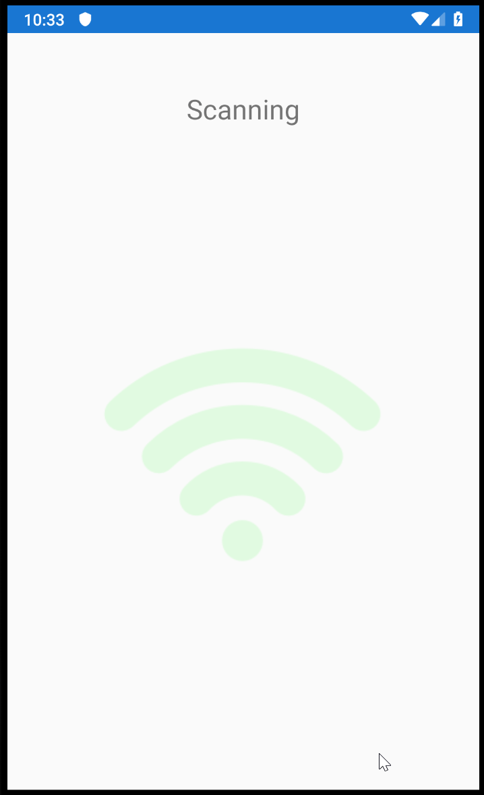

- title : Developing a Fabulous Mobile App
- description : Getting started with Fabulous
- author : Eric Harding
- theme : Night
- transition : default

***
<!-- theme: sky -->

## Developing a Fabulous Mobile App

> Eric Harding  
@digitalsorcery  
https://blog.digitalsorcery.net
https://github.com/ericharding/fabulous_talk

---

## Thanks to 

***

# Storytime
# <i class="fas fa-book"></i> 
<!-- Introduction to fabulous at the meetup
    "do you like it? is it any good?" "it's fabulous"
-->

---

---

### I know this
<!-- Even though Fabulous is relatively new
it feels familiar because most pieces stay the same
-->

---

## F#
* No separate UI language
* No new tools needed

---

## Domain Modeling
* Works with your _existing_ model
* Make illegal states unrepresentable

---

## Immutability
* Designed for functional languages
* No required mutability

---
## Model View Update
* One way data flow
* Single source of truth
<!-- * "fractal" components -->
<!-- * A library Not a framework -->

---

***

### Before MVU?

> We are all here for some special reason. Stop being a prisoner of your past. Become the architect of your future. 
> ― WiseOldSayings.com

---

# MVC

<!-- The classic UI pattern, 
MVC Smalltalk 79
Ask 5 developers what MVC is and you'll get 5 answers
-->

---

# MVP
<!-- basically still MVC... -->

---

# MVVM

<!--  -->

---

# MV_ 
<!-- ### Can be a bit vague -->

> Where's the State?
> -- Jim Bennett

<!-- MVU is not vague.  You can tell by the type signatures 
-->

---

## Tech Support

***

# MVU

* view  : Model -> (Msg->unit) -> Elements
* update : Model -> Msg -> Model
<!-- not vague -->

---

---

# Model
* The **only** state
<!--
You can't hide state anywhere else
-->

---

# View

---

# Update

---

## Counter

---

    type Model =
        { count : int }

    type Msg =
        | Increment
        | Decrement

    let init () = { count = 0 }, Cmd.none

---

    let view (model: Model) dispatch =
        View.ContentPage(
          content = 
            View.StackLayout(padding = 20.0,
                children = [ 
                    View.Label(text = sprintf "%d" model.count, 
                        widthRequest=200.0)
                    View.Button(text = "Increment", 
                        command = (fun () -> dispatch Increment),
                        horizontalOptions = LayoutOptions.Center)
                    View.Button(text = "Decrement", 
                        command = (fun () -> dispatch Decrement), 
                        horizontalOptions = LayoutOptions.Center)
                ]))

---

# Components / "Triplets"
<!--
Show how to do components in MVU
-->

---

***

# Fabulous

---

MVU framework
* Android
* IOS
* Desktop

---

## Fully Native

---

***

## Xamarin Forms

A _Fabulous_ View

---

## Native Controls
* Native look
* Native accessibility

---

## Where to look for help?

***

# SameRoom

---

# todo: code samples and screenshots

---

<!--  -->

---

***

## Animations 
* Get them off the UI thread
* Handling animations during state changes

