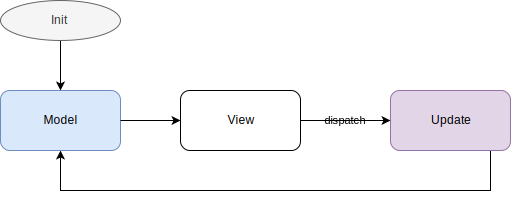

- title : Developing a Fabulous Mobile App
- description : Getting started with Fabulous
- author : Eric Harding
- theme : Night
- transition : default

***
<!-- theme: sky -->

## Developing a Fabulous Mobile App

> Eric Harding  
@digitalsorcery  
https://blog.digitalsorcery.net

---

## Thanks to 

***

# Storytime
<!-- Introduction to fabulous at the meetup
    "do you like it? is it any good?" "it's fabulous"
-->

---

---

I know this!
<!-- Even though Fabulous is relatively new
it feels familiar because most pieces stay the same
-->

---

## F#
* No separate UI language
* No new tools needed

---

## Domain Modeling
* Works with your _existing_ model
* Make illegal states unrepresentable

---

## Immutability
* Designed for functional languages
* No forced mutability

---

## Model View Update
* One way data flow
* Single source of truth
* "fractal" components
* Not a framework

---

***

### Before MVU?

> “You have to know the past to understand the present.”

> ― Carl Sagan 

<!-- short section, complain about state -->

---

# MVC / MV*

<!-- old MVC Smalltalk 78 -->

---

### MVC is a bit vague...

> It's often referred to as a pattern, but I don't find it terribly useful to think of it as a pattern because it contains quite a few different ideas. 
> -- Martin Fowler

<!-- MVU is not vague.  You can tell by the type signatures 
Where's the state?
-->

---

# MVP
* Replaces "Controller" with "Presenter"

---

# MVVM

---

## Tech Support

***

# MVU

Not Vague

* view  : Model -> (Msg->unit) -> Elements
* update : Model -> Msg -> Model

---

---

# TODO: more about MVU

***

## Xamarin Forms

A _Fabulous_ View

---

## Where to look for help?

***

# SameRoom

***

## Animations 
* Get them off the UI thread
* Handling animations during state changes

