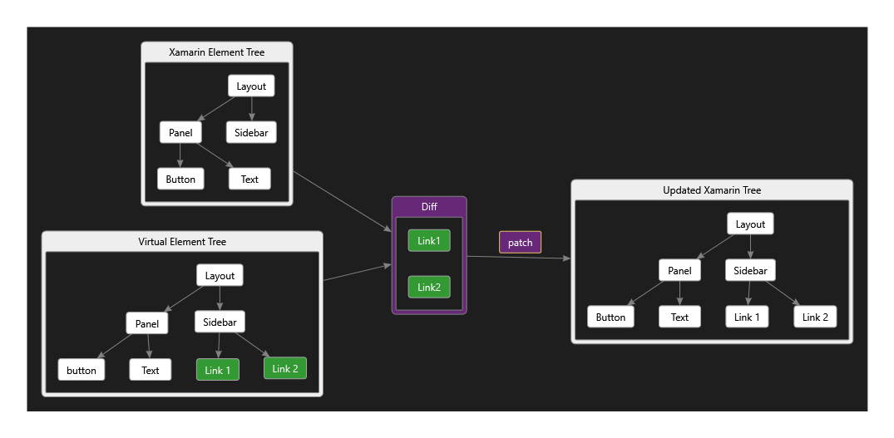

- title : Developing a Fabulous Mobile App
- description : Getting started with Fabulous
- author : Eric Harding
- theme : night
- transition : default

***
<!-- theme: sky -->

## Developing a Fabulous Mobile App

> Eric Harding  
@digitalsorcery  
https://blog.digitalsorcery.net  

---

## Thanks to 

***

# Storytime 
# <i class="fas fa-book"></i> 
<!-- Introduction to fabulous at the meetup -->

---

### I know this
<!-- Even though Fabulous is relatively new
it feels familiar because most pieces stay the same
-->

---

## F#
* No separate UI language
* No new tools

---

## Domain Model
* Works with your _existing_ model
<!-- make illegal states unrepresentable -->

---

## Immutability
* Designed for functional languages
<!-- Never have to add a setter -->

---
## Model View Update
* One way data flow
* Single source of truth

---

***

# Before MVU?

---

# MVC

<!-- The classic UI pattern, 
MVC Smalltalk 79
40th birthday this year
Ask 5 developers what MVC is and you'll get 5 answers
-->

---

# MVP
<!-- when you do a talk on MVC --> 

---

# MVVM

<!-- Accidental complexity
separate designer tooling
code like constructs (behaviors, converters)
-->

---

# MV_ 
> Where's the State?
> -- Jim Bennett

<!-- MV* talk about logic
does your __ have state?
MV_ can be a bit vague.  MVU is not vague.  You can tell by the type signatures 
-->

---

## Tech Support

<!--
Reboot to fix it is so ingrained...
I physically cut my fiber. It was sticking out of the ground and I could look at both ends.
They wouldn't send someone out to fix it until I had rebooted my modem.
-->

***

# MVU

---

# MVU

    Model -> (Msg->unit) -> Elements
    Model -> Msg -> Model

<!-- not vague -->

---

# Model 🗿
* The **only** state
* Immutable
* 🐛 Debugable

<!--
You can't hide state anywhere else
Debugging advantages
    - reproduce problems
    - serialize state
    - Time travel debugging
-->

---

# View 👀

    Model -> (Msg->unit) -> Lightweight Element Tree

<!-- Xamarin forms DSL
virtual DOM
Same language, easy refactoring
Live reload
-->

---

# Update ♻

    Model -> Msg -> Model

<!-- synchronous -->

---

# Example

---

    type Model =
        { count : int }

    type Msg =
        | Increment
        | Decrement

    let init () = { count = 0 }, Cmd.none

---

    let update msg model =
        match msg with
        | Increment -> { model with count = model.count + 1 }, Cmd.none
        | Decrement -> { model with count = model.count - 1 }, Cmd.none

---

    let view (model: Model) dispatch =
        View.ContentPage(
          content = 
            View.StackLayout(
                children = [ 
                    View.Label(text = sprintf "%d" model.count, 
                        widthRequest=200.0)
                    View.Button(text = "Increment", 
                        command = (fun () -> dispatch Increment))
                    View.Button(text = "Decrement", 
                        command = (fun () -> dispatch Decrement))
                ]))

---

# Scaling
* What about components?

---

# "Triplets"
<!-- fractal components -->

---

---

    type Model = 
      { counter : Counter.Model
        text : Reverser.Model }

---
    
    type Msg = 
        | CounterMsg of Counter.Msg 
        | ReverserMsg of Reverser.Msg

---

    let init () = 
        let cstate, ccmd = Counter.init()
        let rstate, rcmd = Reverser.init()
        { counter = cstate; text = rstate }, 
        Cmd.batch [Cmd.map CounterMsg ccmd; Cmd.map ReverserMsg rcmd]

---

    let update msg model =
        match msg with
        | CounterMsg m -> 
            let (cstate, ccmd) = Counter.update m model.counter
            { model with counter = cstate }, Cmd.map CounterMsg ccmd
        | ReverserMsg m -> 
            let (rstate, rcmd) = Reverser.update m model.text
            { model with text = rstate }, Cmd.map ReverserMsg rcmd

---

    let view (model: Model) dispatch =
        View.ContentPage(
          content = View.StackLayout(
            children = [ 
                Counter.view model.counter (CounterMsg>>dispatch)
                Reverser.view model.text (ReverserMsg>>dispatch)
            ]))

---

## When?

<!--
When should I break stuff up?
Break up view/update into functions constantly
In XAML this refactoring is painful, in f# it is not
-->

***

# Fabulous
## =
### MVU + Xamarin Forms
<!-- Established technology -->

---

## Diff & Patch

<!--
Lightweight
New every time
Diff algorithm behind the scenes
-->

---

# Performance

    dependsOn model.Count (fun model count -> ...)

***

# Xamarin Forms

A _Fabulous_ View
<!-- https://docs.microsoft.com/en-us/xamarin/cross-platform/get-started/introduction-to-mobile-development
-->

---

## Cross Platform

- <i class="fab fa-android"></i> Android
- <i class="fab fa-apple"></i> iOS
- <i class="fas fa-desktop"></i> Desktop

<!-- established tech -->

---

## Native Controls
* Native look & feel
* Native accessibility

---

### Complete underlying  API
### *and* 
### .NET BCL

---

## Where to look for help?

* Xamarin Forms documentation
* Elmish / Elm for patterns

***

# Experience 🎭
SameRoom

---
## Auth0

    type IAuthenticationService = 
        abstract member AuthenticateAsync : unit -> 
        Async<IdentityModel.OidcClient.LoginResult>

<!--
    implement interface for all platforms
-->

---

    let loginAuth0 onSuccess onFailure =
        let authenticationService = DependencyService.Get<IAuthenticationService>()
        let popForm = authenticationService.AuthenticateAsync()
        let success result =
            match handleLoginResult result with
            | Good r ->
                onSuccess { someId = r.IdToken }
            | Bad r -> 
                onFailure r.Error
        Async.StartWithContinuations (popForm, 
            success, onFailure, onFailure)

---

    let loginButton = 
        View.Button(
            text = "Login", 
            margin=new Thickness(0.0,10.0,0.0,0.0), 
            command=(fun _ -> 
                loginAuth0 
                    (LogInSucceeded>>dispatch) 
                    (LogInFailed>>dispatch)))

<!-- could also use a command -->

---

## Animations 
* Off the UI thread
<!--
One of the big innovations of mobile
WPF / 16ms 
-->

---

---

    let pulseImage dispatch (image:Image) =
        async {
            for _ in 1..10 do
                let! _ = Async.AwaitTask (image.FadeTo(0.1, 500u))
                let! _ = Async.AwaitTask (image.FadeTo(1.0, 500u))
                ()
            dispatch <| GoToFoundUsers (ChatBot.createRandomUser())
        } |> Async.StartImmediate
<!-- maybe CancellationToken? -->

---
    let private flyIn (g:Grid) =
        g.TranslationY <- 500.
        g.TranslateTo(0., 0., 1000u, Easing.BounceOut)
        |> ignore

    let view model dispatch =
        View.Grid(
            created = flyIn,
            children = [...])

<!-- animations triggered by messages -->

---

## External Data
* Commands
    - returns a message
* Subscriptions
    - dispatches multiple messages

---

---

    let delayMsg milliseconds msg = Cmd.ofAsyncMsg (async {
        do! Async.Sleep milliseconds
        return msg
    })

---

    | GoToConversation otherUser -> 
        { model with Page = Page.Conversation { OtherUser = otherUser; Messages = []; UnsentMessage = "" } },
        Support.delayMsg 1000 
            (ChatReceived <| 
                { Message.User = otherUser; 
                  Text = ChatBot.greeting model.User })
 
---

### Xamarin Essentials

    type ILocationService =
        abstract member GetLocation : unit -> Location option

---

    let locationSub dispatch =
        let locationService = DependencyService.Get<ILocationService>()
        async {
            let loc = locationService.GetLocation()
            dispatch (Location loc)
            do! Async.Sleep 1000
        } |> Async.StartImmidiate

    ...
    Cmd.ofSub locationSub

***

# Questions?

> https://github.com/ericharding/fabulous_talk

