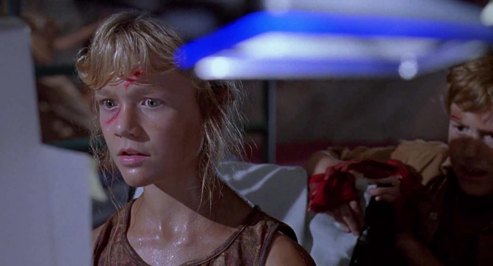

- title : Developing a Fabulous Mobile App
- description : Getting started with Fabulous
- author : Eric Harding
- theme : Night
- transition : default

***
<!-- theme: sky -->

## Developing a Fabulous Mobile App

> Eric Harding  
@digitalsorcery  
https://blog.digitalsorcery.net

---

## Thanks to 

***

# Storytime
<!-- Introduction to fabulous at the meetup
    "do you like it? is it any good?" "it's fabulous"
-->

---

---

I know this!
<!-- Even though Fabulous is relatively new
it feels familiar because most pieces stay the same
* f# / domain modeling
-->

---

## F#

---

## Domain Modeling

---

## Immutability

---

## Model View Update

---

***

## Design patterns
* MVC
* MVVM
* MVU 🔥

<!--
Talk about
-->

***

### Domain Driven Design

---

## Using Xamarin

***

## Where to look for help?

***

## Animations 
* Get them off the UI thread
* Handling animations during state changes

