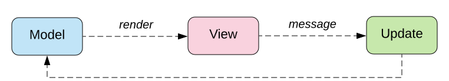

- title : Developing a Fabulous Mobile App
- description : Getting started with Fabulous
- author : Eric Harding
- theme : Night
- transition : default

***
<!-- theme: sky -->

## Developing a Fabulous Mobile App

> Eric Harding  
@digitalsorcery  
https://blog.digitalsorcery.net
https://github.com/ericharding/fabulous_talk

---

## Thanks to 

***

# Storytime 
# <i class="fas fa-book"></i> 
<!-- Introduction to fabulous at the meetup
    "do you like it? is it any good?" "it's fabulous"
-->

---

---

### I know this
<!-- Even though Fabulous is relatively new
it feels familiar because most pieces stay the same
-->

---

## F#
* No separate UI language
* No new tools needed

---

## Domain Modeling
* Works with your _existing_ model
* Make illegal states unrepresentable

---

## Immutability
* Designed for functional languages
* No required mutability
<!-- Never have to add a setter -->

---
## Model View Update
* One way data flow
* Single source of truth

---

***

### Before MVU?

> We are all here for some special reason. Stop being a prisoner of your past. Become the architect of your future. 
> ― WiseOldSayings.com

---

# MVC

<!-- The classic UI pattern, 
MVC Smalltalk 79
Ask 5 developers what MVC is and you'll get 5 answers
-->

---

# MVP
<!-- basically still MVC... -->

---

# MVVM

<!-- Accidental complexity
separate designer tooling
code like constructs (behaviors, converters)
Stateful components
-->

---

# MV_ 
> Where's the State?
> -- Jim Bennett

<!-- MV_ can be a bit vague.  MVU is not vague.  You can tell by the type signatures 
-->

---

## Tech Support

<!--
Reboot to fix it is so ingrained
I physically cut my fiber. It was sticking out of the ground and I could look at both ends.
They wouldn't send someone out to fix it until I had rebooted my modem.
-->

***

# MVU

* view  : Model -> (Msg->unit) -> Elements
* update : Model -> Msg -> Model
<!-- not vague -->

---

---

# Model 🗿
* The **only** state
<!--
You can't hide state anywhere else
Debugging advantages
    - reproduce problems
    - serialize state
    - Time travel debugging
-->

---

# View 👀
<!-- Xamarin forms DSL
Not the same as fable but that's ok
Live reload
Same language, easy refactoring
-->

---

# Update ♻

---

## Sample

---

    type Model =
        { count : int }

    type Msg =
        | Increment
        | Decrement

    let init () = { count = 0 }, Cmd.none

---

    let update msg model =
        match msg with
        | Increment -> { model with count = model.count + 1 }, Cmd.none
        | Decrement -> { model with count = model.count - 1 }, Cmd.none

---

    let view (model: Model) dispatch =
        View.ContentPage(
          content = 
            View.StackLayout(padding = 20.0,
                children = [ 
                    View.Label(text = sprintf "%d" model.count, 
                        widthRequest=200.0)
                    View.Button(text = "Increment", 
                        command = (fun () -> dispatch Increment),
                        horizontalOptions = LayoutOptions.Center)
                    View.Button(text = "Decrement", 
                        command = (fun () -> dispatch Decrement), 
                        horizontalOptions = LayoutOptions.Center)
                ]))

---

## Scaling
* What about components?

---

# "Triplets"
<!-- fractal components -->

---

---

    type Model = 
      { counter : Counter.Model
        text : Reverser.Model }

---
    
    type Msg = 
        | CounterMsg of Counter.Msg 
        | ReverserMsg of Reverser.Msg

---

    let init () = 
        let cstate, ccmd = Counter.init()
        let rstate, rcmd = Reverser.init()
        { counter = cstate; text = rstate }, 
        Cmd.batch [Cmd.map CounterMsg ccmd; Cmd.map ReverserMsg rcmd]

---

    let update msg model =
        match msg with
        | CounterMsg m -> 
            let (cstate, ccmd) = Counter.update m model.counter
            { model with counter = cstate }, Cmd.map CounterMsg ccmd
        | ReverserMsg m -> 
            let (rstate, rcmd) = Reverser.update m model.text
            { model with text = rstate }, Cmd.map ReverserMsg rcmd

---

    let view (model: Model) dispatch =
        View.ContentPage(
          content = View.StackLayout(
            children = [ 
                Counter.view model.counter (CounterMsg>>dispatch)
                Reverser.view model.text (ReverserMsg>>dispatch)
            ]))

---

## When?

<!--
When should I break stuff up?
Break up view/update into functions constantly
In XAML this refactoring is painful, in f# it is not
-->

***

# Fabulous
## =
### MVU + Xamarin Forms

---

### MVU 💜 Xamarin Forms
* Android
* IOS
* Desktop
<!-- mac, windows, Linux -->
<!-- established tech -->

---

## Virtual Elements

<!--
New every time
Diff algorithm behind the scenes
-->

---

## Native Controls

***

## Xamarin Forms

A _Fabulous_ View

---

## Native Controls
* Native look
* Native accessibility

---

## Where to look for help?

***

# SameRoom

---

# todo: code samples and screenshots

---

<!--  -->

---

***

## Animations 
* Get them off the UI thread
* Handling animations during state changes

